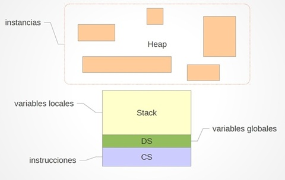
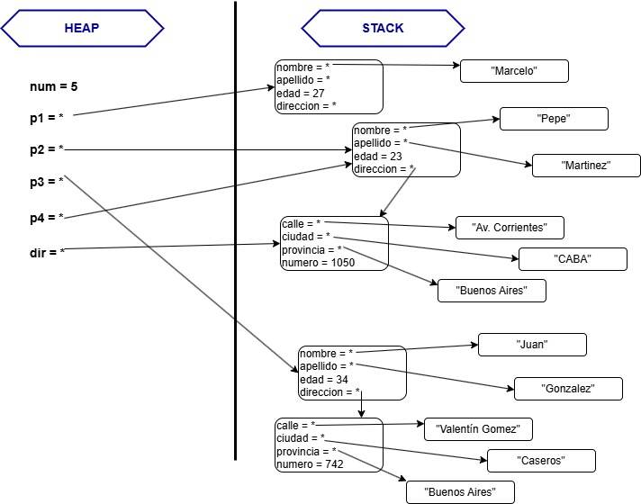

# Gestión de Memoria

## Repaso de algunos conceptos

### Organización de la memoria

* Memoria **secundaria**
 
  Conformada por el conjunto de memorias no volátiles.
  
  Es la memoria de persistencia de información.

* Memoria **central** o **primaria**
 
  Constituida por memoria volátil.

  Es la memoria de trabajo del procesador.

### Ejecución de programas

* Los programas son almacenados en la
memoria secundaria.
* Al momento de lanzar la ejecución de un
programa, el conjunto de instrucciones
que lo componen es copiado a la
memoria central.
* Un programa en ejecución se denomina
proceso.

### Segmentos de memoria

En tiempo de ejecución, un proceso está asociado a una porción de la memoria central que se divide lógicamente en 4 segmentos:

* **Code Segment (Segmento de Código)**: 
  * Es la porción donde se localizarán las instrucciones que componen nuestro programa.
  * Es de tamaño fijo, determinado al comenzar la ejecución.

* **Data Segment (Segmento de Datos)**: 
  * Almacenará el contenido de las variables definidas en el modulo principal (variables globales). 
  * Es de tamaño fijo, determinado al comenzar la ejecución.
* **Stack Segment (Pila)**: 
  * Almacenará el contenido de las variables locales en cada invocación de una función. 
  * Es de tamaño fijo, determinado al comenzar la ejecución. 
  * Cada entrada en el **stack** constituye el contexto de un método en ejecución:
    * Variables locales
    * Parámetros
    * Resultado
* **Extra Segment o Heap**: 
  * Se utiliza para las peticiones dinámicas de memoria.
  * Tamaño dinámico.
  * Memoria no contigua.
  * La memoria del heap puede ser asignadaen tiempo de ejecución a los programas en función de sus necesidades:
    * Asignación dinámica de memoria
    * Liberación dinámica de memoria

## Esquema de la memoria


## Gestión de Memoria en Go

La gestión de memoria es un aspecto clave en cualquier lenguaje de programación, ya que impacta en el rendimiento, la eficiencia y la estabilidad del software. Algunos lenguajes como C requieren una administración manual de la memoria, mientras que otros como Java y Python utilizan un **Garbage Collector (GC)** para automatizar la liberación de memoria.

Go (o Golang) combina lo mejor de ambos mundos:

* Un **GC concurrente y eficiente**, con pausas reducidas.

* Un modelo de asignación de memoria optimizado con **Stack, Heap y Escape Analysis**.

Analizaremos cómo Go gestiona la memoria y cómo podemos optimizar su uso.

## Stack vs. Heap en Go

Go asigna memoria en dos regiones principales:

* **Stack**: Espacio de memoria de crecimiento limitado donde se almacenan variables locales de funciones. Es rápido y eficiente, pero su capacidad es limitada.

* **Heap**: Espacio de memoria dinámico donde se almacenan estructuras más grandes o variables con tiempo de vida prolongado. Su administración es más costosa debido al GC.

**Ejemplo:**

``` {code-cell} go
type Direccion struct {
    calle, ciudad, provincia string
    numero                   uint
}
type Persona struct {
    nombre, apellido string
    edad             uint
    direccion        Direccion
}

var num int = 5

var p1 Persona
p1.nombre = "Marcelo"
p1.edad = 27

p2 := Persona{nombre: "Pepe", edad: 23}
p3 := Persona{"Juan", "Gonzalez", 34, Direccion{"Valentín Gomez", "Caseros", "Buenos Aires", 742}}
p4 := p2

dir:= Direccion{"Av. Corrientes", "CABA", "Buenos Aires", 1050}

p4.apellido = Martinez
p4.direccion = dir
```
**Mapa de memoria del codigo anterior:**



## Asignación de Memoria: ```new()``` vs ```make()```

Go proporciona dos formas principales de asignar memoria:

### ```new()```

* Reserva memoria pero no la inicializa.

* Devuelve un puntero al tipo de dato especificado.

``` {code-cell} go
p := new(int) // p es un puntero a un entero

fmt.Println(*p) //valor guardado en la direccion de memoria de a la que apunta p
fmt.Println(p) //direccion de memoria a la que apunta p
fmt.Println(&p)
```

### ```make()```

* Se usa para inicializar **slices, maps y channels**.

* Asigna y prepara estructuras para su uso.

``` {code-cell} go
s := make([]int, 5) // Slice con capacidad y longitud 5
```

Diferencia clave: ```new()``` solo asigna memoria, ```make()``` inicializa estructuras internas.

## Garbage Collector (GC) en Go

Go utiliza un **GC concurrente** para liberar memoria automáticamente. 

Cuando se dice que el Garbage Collector (GC) de Go es concurrente, significa que puede ejecutar la recolección de basura mientras el programa sigue en ejecución.

Algunas características clave:

* Minimiza las pausas para mejorar el rendimiento.

* Usa múltiples núcleos de CPU para ejecutar la recolección en paralelo.

* Detecta y elimina referencias a objetos no utilizados.


## ¿Cómo logra esto el GC de Go?

### 1. Algoritmo Tricolor Mark-Sweep

 * Divide los objetos en:
   * **blancos** (no alcanzados, serán eliminados)
   * **grises** (en proceso de análisis) 
   * **negros** (alcanzados y ya analizados)
 * Marca y rastrea los objetos accesibles sin detener completamente la ejecución del programa.

### 2. Pausas muy cortas (low-pause GC)

 * Go minimiza los "stop-the-world" (momentos en los que detiene completamente la ejecución para limpiar memoria).
 * La mayoría del trabajo del GC ocurre en paralelo con la ejecución del código.

### 3. Ejecución en múltiples hilos

 * El GC usa múltiples núcleos de la CPU para hacer la recolección de basura sin bloquear las goroutines activas.

### Beneficio principal
Un GC concurrente mejora el rendimiento y la experiencia del usuario, ya que evita grandes pausas en la ejecución del programa. Esto es fundamental en servidores y sistemas en tiempo real, donde una pausa larga podría afectar la respuesta del sistema.

## Escape Analysis: Stack vs. Heap

El compilador de Go decide automáticamente si una variable debe almacenarse en el **Stack** o en el **Heap**. Esto se conoce como **Escape Analysis**.

Si una variable "escapa" del alcance de la función, se almacena en el Heap en lugar del Stack. 

**Ejemplo:**
``` {code-cell} go
func stack() {
    x := 10  // Se asigna en el Stack
}

func heap() *int {
    p := new(int)  // Se asigna en el Heap porque se devuelve un puntero
    return p      //retorna el puntero
}
```

## Optimización de Memoria en Go

Algunas estrategias para mejorar el uso de memoria:

* Preasignar capacidad en slices con make().

* Evitar fugas de memoria eliminando referencias innecesarias.

* Minimizar uso de punteros si no son necesarios.

**Ejemplo de preasignación en slices:**

## Ejemplo Práctico de Optimización

### Mala Práctica: Crecimiento descontrolado de slices

``` {code-cell} go
var data []int
for i := 0; i < 1000000; i++ {
    data = append(data, i) // Reasignaciones y consumo extra de memoria
}
```

### Buena Práctica: Prealocar capacidad

``` {code-cell} go
data := make([]int, 1000000) // Mejor que ir agregando con append
for i := 0; i < 1000000; i++ {
    data[i] = i
}
```

Esta optimización reduce el número de **realocaciones de memoria**, mejorando el rendimiento.

## Conclusión

* Go proporciona un modelo de memoria eficiente con Stack, Heap y Escape Analysis.

* Su GC concurrente optimiza la recolección de basura con el algoritmo Tricolor Mark-Sweep.

* Prestar atención al uso de memoria puede mejorar el rendimiento de los programas en Go.


